🇰🇷 <b>한국어</b> · 🇺🇸 <a href="./README.md">English</a>

## 소개

정희진입니다. 소프트웨어 마에스트로 17기로 활동하고 있습니다. 백엔드는 Java와 Spring Boot로 시작했고, 지금은 Swift로 macOS 앱을 내놓고 있습니다. 메뉴바 포모도로 타이머 Pomopet을 만들어 Homebrew로 배포하고 있습니다. 오픈소스 macOS 앱 CodexBar에도 기여하고 있습니다.

이력서 & 포트폴리오: **[kes02.github.io](https://kes02.github.io/)**

## 오픈소스 기여

**[steipete/CodexBar](https://github.com/steipete/CodexBar)** · `Swift` — AI 코딩 도구의 사용량 한도를 메뉴바에서 한눈에 보여주는 macOS 앱. PR 4건 머지, 버그 2건 제보 및 원인 분석 ([상세](https://kes02.github.io/resume)).

## 프로젝트

**[Pomopet](https://github.com/kes02/Pomopet)**: 공부를 함께하고 싶은 펫을 입력하고, 펫과 함께 공부를 이어가는 macOS 메뉴바 포모도로 타이머. 일일 스트릭과 활동 잔디 기록을 지원합니다.
`Swift` · `SwiftUI` · `SwiftData` · [`homebrew-pomopet`](https://github.com/kes02/homebrew-pomopet)로 설치

**[jin-skills](https://github.com/kes02/jin-skills)**: 직접 만들어 쓰는 Claude Code 스킬 7개를 플러그인으로 묶은 모음. 커밋·PR 컨벤션, 티켓 작성, 웹 리서치 등을 다룹니다.
`Claude Code` · `Shell`

**[time-mirror](https://github.com/kes02/time-mirror)**: 예상 계획과 실제 계획을 나란히 놓고 보는 타임라인 플래너(PWA). 세운 계획대로 하루를 보냈는지 되돌아봅니다.
`TypeScript` · `PWA`

**[js-boj-fetch](https://github.com/kes02/js-boj-fetch)**: 사용자가 요청한 조건에 맞는 풀지 않은 백준 문제를 추천해 주는 서비스.
`JavaScript`

## 통계

| GitHub Stats | Top Languages |
| :---: | :---: |
|  |  |

## 연락처

