## 🧑‍💻 Contact me

## 🛠️ Tech Stacks (Experienced)

<table style="width: 100%; border-collapse: collapse;">
  <thead>
    <tr>
      <th width="50%" align="left" style="min-width: 400px;">💻 Core Stacks (Current Focus)</th>
      <th width="50%" align="left" style="min-width: 400px;">📚 Experienced (Projects & Internships)</th>
    </tr>
  </thead>
  <tbody>
    <tr>
      <td valign="top">
        <b>Backend & Languages</b> 
        
        
        
      </td>
      <td valign="top">
        <b>Languages</b> 
        
        
        
        
      </td>
    </tr>
    <tr>
      <td valign="top">
        <b>Frontend</b> 
        
        
      </td>
      <td valign="top">
        <b>Infrastructure & Cloud</b> 
        
        
      </td>
    </tr>
    <tr>
      <td valign="top">
        <b>Version Control</b> 
        
        
      </td>
      <td valign="top">
        <b>Tools & Design</b> 
        
        
        
      </td>
    </tr>
  </tbody>
</table>

 

 

## 🏅 Stats

| GitHub Stats | Top Languages |
| :---: | :---: |
|  |  |

### 🔥 Streak Stats (활동 기록)

